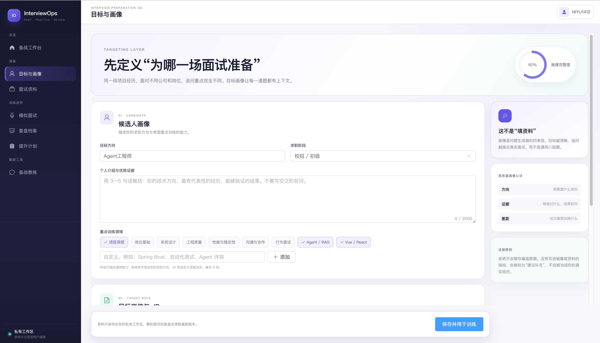
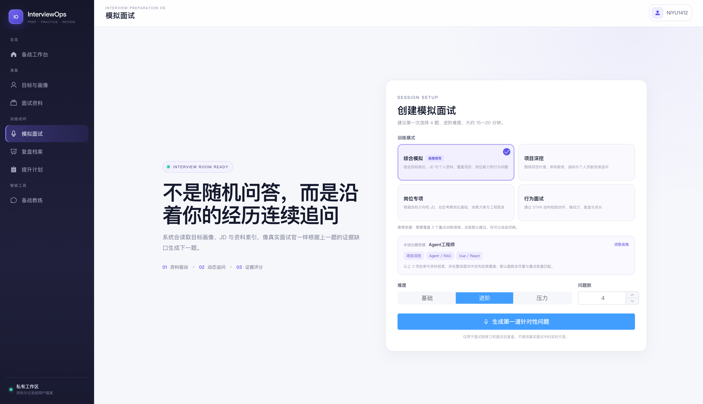
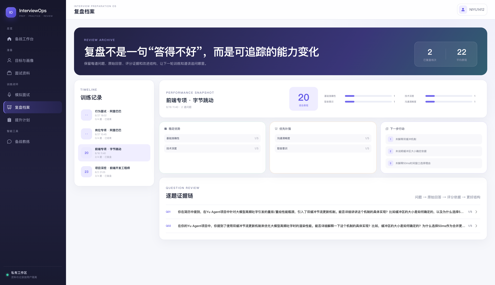
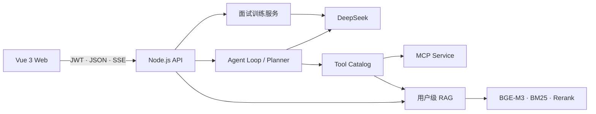

# InterviewOps

> 面向求职准备的 AI 面试训练与复盘平台。

InterviewOps 将候选人画像、目标岗位 JD 和个人资料组织为可复用的训练上下文，帮助用户完成「准备资料 → 模拟作答 → 动态追问 → 结构化复盘 → 制定下一步计划」的闭环。

`Vue 3` · `Vite` · `Pinia` · `Node.js` · `DeepSeek` · `MCP` · `RAG` · `SSE`

## 解决什么问题

常见的面试练习往往只有固定题库或通用问答：题目和目标岗位脱节，反馈无法说明依据，练习结束后也不知道下一步该补什么。InterviewOps 把用户自己的目标、资料与每次练习记录连接起来，使训练过程可追溯、可复盘。

| 问题 | InterviewOps 的处理方式 |
| --- | --- |
| 出题不够针对性 | 结合目标方向、岗位 JD、项目资料与训练领域生成问题。 |
| 反馈过于笼统 | 按能力维度输出评分、有效证据、缺失信息与改进建议。 |
| 练习没有延续性 | 保存训练记录，汇总优势、待补强项和下一轮行动计划。 |

## 使用闭环

1. **配置目标**：填写目标方向、求职阶段、目标公司与岗位 JD，选择本轮训练重点。
2. **补充资料**：上传简历、项目资料或笔记，建立仅属于当前用户的知识索引。
3. **创建训练**：选择综合模拟、项目深挖、岗位专项或行为面试，并配置难度和题数。
4. **进行模拟**：系统基于训练上下文出题，根据回答中的证据与缺口继续追问。
5. **复盘提升**：查看逐题反馈、能力维度表现与下一步行动，将结果沉淀为后续训练依据。

## 界面预览

### 01 · 目标与画像

通过目标岗位、JD、个人优势和训练领域，为后续题目与反馈建立统一上下文。



### 02 · 创建模拟面试

根据本轮目标选择训练模式、难度和题目数量；界面同时展示系统将使用的训练重点。



### 03 · 复盘档案

保留训练时间线和逐题证据链，并将表现拆分为能力维度、优先补强项和下一步行动。



> 截图中的资料与训练记录均为演示数据。

## 核心设计

### 上下文驱动的模拟训练

面试服务将用户画像、目标 JD、已上传资料与训练模式组合为训练上下文。系统不是从固定题库顺序取题，而是根据上一轮回答中的有效证据和能力缺口决定是否追问及下一题方向。

### Agent 与工具编排

基于 DeepSeek Function Calling 实现多轮 Agent Loop；统一 Tool Catalog 管理知识检索、网络搜索、待办和笔记等 10 项工具的参数 Schema、用户作用域与超时控制。Planner 会对复杂请求进行任务拆解与依赖排序，同一轮内相互独立的工具调用可并行执行，单项失败不会中断最终回答。

### 用户级 RAG

文档先经过文本提取、重叠分块和索引，再使用 BGE-M3 向量召回与 BM25 关键词召回获取候选片段，通过 RRF 融合和 Reranker 重排。检索结果会携带资料来源和相关原文，便于追溯回答依据。

### 流式交互与数据边界

服务端通过 SSE 分别传输回答文本、引用来源和工具执行状态；前端支持增量解析、请求中止和异常恢复。用户身份由 JWT 在服务端解析，画像、训练记录、知识库、待办和笔记均按可信用户身份隔离读写。

## 技术架构



## 项目结构

```text
├── src/
│   ├── views/                 # 工作台、画像、资料、训练、复盘、计划与教练
│   ├── stores/                # 登录态、会话与任务状态
│   └── utils/                 # API、SSE 与业务客户端
├── backend/
│   ├── interview/             # 会话流程、评分与复盘聚合
│   ├── documents/             # DOCX、PDF 与文本解析
│   ├── rag/                   # 用户级知识索引与混合检索
│   ├── tools/                 # 工具目录、Schema 与权限约束
│   ├── observability/         # Prometheus 指标
│   ├── evals/                 # 工具路由与评分结构评测
│   ├── index.js               # API、Planner、Agent Loop 与 SSE
│   └── mcp-server.js          # MCP 工具服务
├── tests/                     # 前端状态与流式解析测试
├── docs/assets/interviewops/  # README 界面预览图
└── docker-compose.yml         # Web、API、MCP 与持久化卷
```

## 快速启动

### 1. 环境要求

- Node.js `>=22.12 <25`
- DeepSeek API Key
- SiliconFlow API Key
- Serper API Key（可选，用于网络搜索）

### 2. 安装依赖

```bash
git clone https://github.com/yiweiyih/InterviewOps.git
cd InterviewOps

nvm use
npm ci
npm ci --prefix backend
cp backend/.env.example backend/.env
```

### 3. 配置环境变量

编辑 `backend/.env`：

```env
JWT_SECRET=replace-with-at-least-32-random-characters
DEEPSEEK_API_KEY=your-deepseek-key
DEEPSEEK_BASE_URL=https://api.deepseek.com/chat/completions
SILICONFLOW_API_KEY=your-siliconflow-key
SERPER_API_KEY=your-serper-key
```

### 4. 启动项目

```bash
npm run dev
```

启动后访问 `http://localhost:5173`。

| 服务 | 默认地址 |
| --- | --- |
| Web | `http://localhost:5173` |
| API | `http://localhost:3001` |
| MCP | `http://localhost:3002` |
| Prometheus | `http://localhost:3001/metrics` |

## 常用命令

| 命令 | 作用 |
| --- | --- |
| `npm run dev` | 同时启动 Web、API 和 MCP |
| `npm run build` | 构建前端生产资源 |
| `npm run check` | 运行前后端测试、构建与语法检查 |
| `npm run eval:interview` | 校验评分输出结构 |
| `npm run eval:tools:dry` | 校验工具路由数据集与 Schema |
| `npm run eval:tools` | 使用真实模型运行工具路由评测 |

## Docker 部署

```bash
docker compose up --build -d
```

Docker Compose 会启动 Web、API 和 MCP，并将 `/data` 挂载到命名卷 `agent-data`。停止服务：

```bash
docker compose down
```

默认持久化使用本地 JSON 和向量文件，适合个人使用与单实例部署。多实例部署时建议将业务数据迁移到 PostgreSQL，并使用 pgvector 或 Milvus 管理向量索引。
