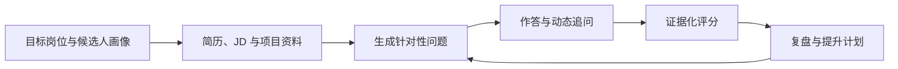
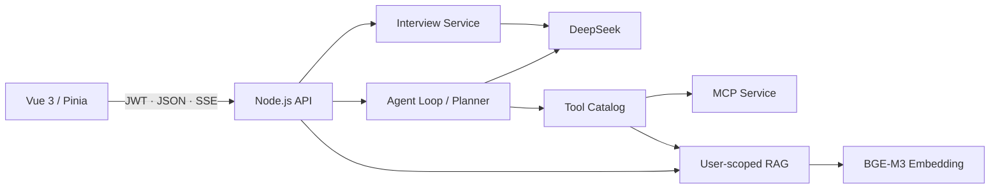

# InterviewOps

面向技术求职者的 AI 面试训练与复盘系统。它会读取候选人的目标岗位、JD、简历与项目资料，生成针对性问题，并根据回答中的真实证据持续追问、评分和沉淀复盘。

> Vue 3 · Node.js · DeepSeek Function Calling · MCP · User-scoped RAG · SSE

## 项目概览

InterviewOps 解决的不是“让大模型随机出几道面试题”，而是面试准备中的三个连续问题：

| 问题 | InterviewOps 的处理方式 |
| --- | --- |
| 练习内容与目标岗位脱节 | 使用候选人画像、目标 JD 和私有资料约束问题生成 |
| 反馈泛化，无法核验 | 只依据回答中出现的事实评分，分别展示证据、缺失点和改进结构 |
| 多次练习彼此割裂 | 聚合能力维度与逐题反馈，生成复盘档案和下一轮提升计划 |

产品边界限定为**面试前训练与面试后复盘**，不提供真实面试中的实时代答。

## 训练闭环



用户可以完成以下流程：

1. 设置目标方向、目标公司、岗位 JD、个人优势和重点训练领域。
2. 上传 DOCX、PDF、Markdown、TXT 或 JSON 格式的简历与项目资料。
3. 选择综合模拟、项目深挖、岗位专项或行为面试，以及难度和题目数量。
4. 系统根据资料生成第一题，并结合上一轮回答的证据缺口动态追问。
5. 每题输出能力维度评分、有效证据、薄弱点和更好的回答结构。
6. 训练结束后生成综合表现、优势短板和下一步行动，并保留完整问答记录。

## 核心设计

### 1. 面试领域状态机

面试过程被建模为“创建会话—生成问题—提交回答—结构化评分—生成下一题—完成复盘”。问题生成同时参考目标方向、JD、重点训练领域、RAG 召回资料和历史问答，并通过相似度检测减少重复问题。

### 2. 证据化评分合同

模型按固定 JSON 结构返回分数、证据、优势、缺失点和改进结构。服务端负责字段归一化、分数边界约束与最终报告聚合，避免模型自由发挥总分，也不会替候选人补写不存在的经历或指标。

### 3. 用户级 RAG 知识库

资料上传后完成文本提取、重叠分块和 `BAAI/bge-m3` 向量化，通过余弦相似度进行 Top-K 召回。检索范围由服务端可信身份限定，回答携带资料来源和相关片段，上传原文件在解析后删除。

### 4. Agent 任务编排

基于 DeepSeek Function Calling 实现最多 5 轮的 Agent Loop，统一接入知识检索、网络搜索、待办、笔记等 10 项工具：

- Planner 将复杂请求拆成带依赖关系的任务，并通过拓扑排序确定执行顺序；
- 同一轮的多个工具调用使用 `Promise.allSettled` 并行执行，单个工具失败不会中断其他结果；
- Tool Catalog 统一维护参数 Schema、调用方式、用户作用域和超时时间；
- 用户身份由服务端注入，模型不能传入或覆盖 `userId`。

### 5. 流式交互与工程质量

回答文本、资料引用和工具执行状态通过 SSE 分事件传输，前端统一解析并支持中止与自动恢复。仓库包含面试领域、RAG、工具治理和流式解析测试，同时使用 GitHub Actions 执行测试、构建、评测集校验与依赖审计。

## 技术架构



| 层级 | 技术与职责 |
| --- | --- |
| Web | Vue 3、Vite、Pinia、Vue Router、Element Plus |
| API | Node.js、Express、JWT、面试状态编排与数据隔离 |
| Agent | DeepSeek Function Calling、Planner、Tool Catalog、MCP |
| RAG | 文档解析、重叠分块、BGE-M3 Embedding、余弦相似度召回 |
| 交互 | SSE 文本流、引用事件、工具状态事件、请求中止与恢复 |
| 质量 | Node Test Runner、评测集、Prometheus、GitHub Actions、Docker Compose |

## 目录结构

```text
├── src/
│   ├── views/                 # 工作台、画像、资料、模拟、复盘、计划与教练
│   ├── stores/                # 登录态、会话与任务状态
│   └── utils/                 # API、SSE 与面试领域客户端
├── tests/                     # 前端状态与流式解析测试
├── backend/
│   ├── interview/             # 面试状态、评分合同与复盘聚合
│   ├── documents/             # DOCX、PDF 与文本解析
│   ├── rag/                   # 用户级向量索引与召回
│   ├── tools/                 # 工具目录、Schema 与权限约束
│   ├── observability/         # Prometheus 指标
│   ├── evals/                 # 工具路由与评分合同评测集
│   ├── index.js               # API、Planner、Agent Loop 与 SSE
│   └── mcp-server.js          # MCP 工具服务
└── docker-compose.yml         # Web、API、MCP 与持久化卷
```

## 快速开始

### 环境要求

- Node.js `>=22.12 <25`，仓库已提供 `.nvmrc`
- DeepSeek API Key
- SiliconFlow API Key，用于 BGE-M3 向量索引
- Serper API Key，可选，仅用于实时网络搜索

```bash
git clone https://github.com/yiweiyih/agentic-rag-assistant.git
cd agentic-rag-assistant

nvm use
npm ci
npm ci --prefix backend
cp backend/.env.example backend/.env
```

在 `backend/.env` 中填写必要配置：

```env
JWT_SECRET=replace-with-at-least-32-random-characters
DEEPSEEK_API_KEY=your-deepseek-key
DEEPSEEK_BASE_URL=https://api.deepseek.com/chat/completions
SILICONFLOW_API_KEY=your-siliconflow-key
SERPER_API_KEY=your-serper-key
```

一条命令启动 Web、API 和 MCP：

```bash
npm run dev
```

访问 `http://localhost:5173`。API 和 MCP 默认运行在 `3001`、`3002` 端口，Prometheus 指标位于 `http://localhost:3001/metrics`。

## 验证

```bash
# 前端测试与构建、后端语法检查与单元测试
npm run check

# 面试评分合同回归
npm run eval:interview

# 工具路由数据集与 Schema 校验
npm run eval:tools:dry

# 调用真实模型运行工具路由评测
npm run eval:tools
```

## 部署与数据边界

项目提供 Docker Compose，可在单机环境启动 Web、API 与 MCP。`DATA_DIR` 用于统一管理用户账号、面试记录、RAG 索引、长期记忆、待办和笔记；Compose 默认将 `/data` 挂载到命名卷，容器重建不会清空数据。

当前持久化方案采用本地 JSON 与向量文件，适合个人使用、作品集演示和单实例部署。正式多实例环境应迁移到 PostgreSQL 与 pgvector/Milvus，并补充对象存储、分布式限流和链路追踪。

<details>
<summary>主要 API</summary>

| Method | Path | 作用 |
| --- | --- | --- |
| `GET/PUT` | `/api/interview/workspace` | 读取或更新候选人画像与目标岗位 |
| `GET/POST` | `/api/interview/sessions` | 查询训练记录或创建模拟面试 |
| `POST` | `/api/interview/sessions/:id/answer` | 提交回答、评分并生成下一题 |
| `POST` | `/api/interview/sessions/:id/complete` | 提前结束并生成阶段性报告 |
| `GET` | `/api/knowledge` | 查询用户级面试资料 |
| `POST` | `/api/knowledge/upload` | 上传并索引面试资料 |
| `DELETE` | `/api/knowledge/:source` | 删除资料及其索引片段 |
| `POST` | `/api/chat` | 备战教练 Agent Loop 与 SSE |
| `GET/POST/PATCH/DELETE` | `/api/todos` | 管理提升计划 |
| `GET` | `/api/dashboard` | 获取备战摘要 |

</details>

## 延伸阅读

- [面试讲解与追问准备](docs/INTERVIEW_GUIDE.md)
- [CI 工作流](.github/workflows/ci.yml)

> 评分仅用于训练反馈，不代表任何公司的真实录用标准。
