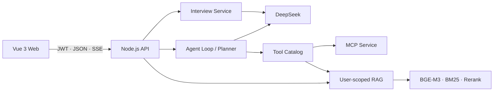

# InterviewOps

InterviewOps 是一个基于大模型的个性化面试训练平台。系统结合用户画像、目标 JD 和私有资料生成针对性问题，并通过动态追问、结构化反馈和复盘计划形成完整的训练流程。

> Vue 3 · Vite · Pinia · Node.js · DeepSeek · MCP · RAG · SSE

## 主要功能

- **目标与画像**：维护目标方向、求职阶段、目标公司、岗位 JD 和重点训练领域。
- **私有资料库**：上传 DOCX、PDF、Markdown、TXT 或 JSON 文件，建立用户级知识索引。
- **模拟训练**：支持综合模拟、项目深挖、岗位专项和行为面试，可配置难度与题目数量。
- **动态追问**：根据用户资料、历史问题和上一轮回答继续生成问题，减少重复出题。
- **结构化反馈**：输出能力维度评分、有效证据、优势、缺失点和回答优化建议。
- **复盘与计划**：汇总训练表现、能力短板和下一步行动，保留完整训练记录。
- **AI 备战教练**：调用知识检索、网络搜索、待办和笔记等工具完成资料问答与任务规划。

## 技术架构



### Agent 编排

基于 DeepSeek Function Calling 实现多轮 Agent Loop，并通过统一 Tool Catalog 管理 10 项工具的参数 Schema、调用方式、用户作用域和超时时间。Planner 负责复杂任务拆解与依赖排序；同一轮的多个工具调用并行执行，单个工具失败不会阻塞其他结果。

### 用户级 RAG

文档经过文本提取和重叠分块后，使用 BGE-M3 向量召回与 BM25 关键词召回生成候选集，再通过 RRF 融合和 Reranker 重排。检索过程按服务端用户身份隔离，并返回资料来源与相关片段。

### 流式交互

服务端通过 SSE 分别传输回答文本、资料引用和工具执行状态；前端统一处理增量解析、请求中止和异常恢复。

### 数据隔离

JWT 在服务端解析，用户身份不会交给模型生成。画像、训练记录、RAG、长期记忆、待办和笔记均按可信用户身份进行读写隔离。

## 项目结构

```text
├── src/
│   ├── views/                 # 工作台、画像、资料、训练、复盘、计划与教练
│   ├── stores/                # 登录态、会话与任务状态
│   └── utils/                 # API、SSE 与业务客户端
├── tests/                     # 前端状态与流式解析测试
├── backend/
│   ├── interview/             # 会话流程、评分与复盘聚合
│   ├── documents/             # DOCX、PDF 与文本解析
│   ├── rag/                   # 用户级知识索引与混合检索
│   ├── tools/                 # 工具目录、Schema 与权限约束
│   ├── observability/         # Prometheus 指标
│   ├── evals/                 # 工具路由与评分结构评测
│   ├── index.js               # API、Planner、Agent Loop 与 SSE
│   └── mcp-server.js          # MCP 工具服务
└── docker-compose.yml         # Web、API、MCP 与持久化卷
```

## 快速启动

### 1. 环境要求

- Node.js `>=22.12 <25`
- DeepSeek API Key
- SiliconFlow API Key
- Serper API Key，可选，用于网络搜索

### 2. 安装依赖

```bash
git clone https://github.com/yiweiyih/agentic-rag-assistant.git
cd agentic-rag-assistant

nvm use
npm ci
npm ci --prefix backend
cp backend/.env.example backend/.env
```

### 3. 配置环境变量

编辑 `backend/.env`：

```env
JWT_SECRET=replace-with-at-least-32-random-characters
DEEPSEEK_API_KEY=your-deepseek-key
DEEPSEEK_BASE_URL=https://api.deepseek.com/chat/completions
SILICONFLOW_API_KEY=your-siliconflow-key
SERPER_API_KEY=your-serper-key
```

### 4. 启动项目

```bash
npm run dev
```

启动后访问 `http://localhost:5173`。

| 服务 | 默认地址 |
| --- | --- |
| Web | `http://localhost:5173` |
| API | `http://localhost:3001` |
| MCP | `http://localhost:3002` |
| Prometheus | `http://localhost:3001/metrics` |

## 常用命令

| 命令 | 作用 |
| --- | --- |
| `npm run dev` | 同时启动 Web、API 和 MCP |
| `npm run build` | 构建前端生产资源 |
| `npm run check` | 运行前后端测试、构建与语法检查 |
| `npm run eval:interview` | 校验评分输出结构 |
| `npm run eval:tools:dry` | 校验工具路由数据集与 Schema |
| `npm run eval:tools` | 使用真实模型运行工具路由评测 |

## Docker 部署

```bash
docker compose up --build -d
```

Docker Compose 会启动 Web、API 和 MCP，并将 `/data` 挂载到命名卷 `agent-data`。停止服务：

```bash
docker compose down
```

默认持久化使用本地 JSON 和向量文件，适合个人使用与单实例部署。多实例部署时建议将业务数据迁移到 PostgreSQL，并使用 pgvector 或 Milvus 管理向量索引。
