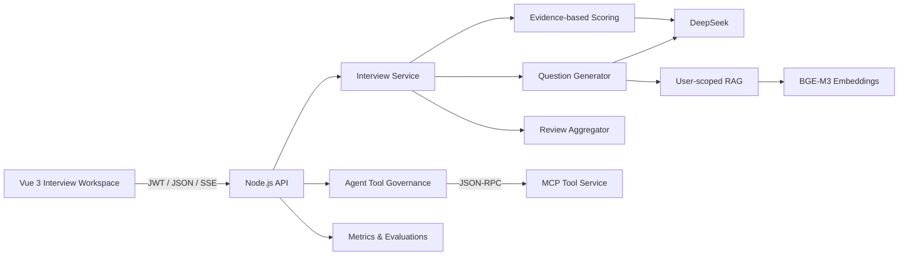

# InterviewOps

一个面向技术校招与社招准备的面试训练系统：把候选人的简历、目标 JD 和项目资料变成针对性问题，通过动态追问、证据化评分和复盘档案形成持续改进闭环。

> Vue 3 · Node.js · DeepSeek · MCP · User-scoped RAG · SSE · Evaluation

## 为什么做这个项目

大多数模拟面试产品停留在“模型随机出题、回答后给一句建议”。InterviewOps 重点解决三个更真实的问题：

| 用户问题 | 产品方案 |
| --- | --- |
| 题目和候选人的经历、目标岗位无关 | 用候选人画像、目标 JD 和私有资料约束问题生成 |
| 反馈泛泛，甚至替候选人编造经历 | 评分只引用回答中出现的证据，缺失信息单独标注 |
| 练习结束后没有形成长期提升 | 聚合能力维度、保留逐题证据链，并沉淀成提升计划 |

它不是在线面试代答工具。产品边界明确限定为面试前训练和面试后复盘。

## 核心体验

1. **目标与画像**：设置目标岗位、公司、面试日期、个人优势和重点训练方向。
2. **面试资料**：上传 DOCX、PDF、Markdown、TXT 或 JSON 格式的简历、JD、项目和面试记录。
3. **模拟面试**：选择项目深挖、前端专项、Agent/RAG 或行为面试；支持 2—8 题和三档难度。
4. **动态追问**：下一题会结合上一题的缺口生成，不是预先写死的问题列表。
5. **逐题反馈**：输出回答中的有效证据、薄弱点、1—5 分维度评分和更好的表达结构。
6. **复盘档案**：生成 100 分综合表现、优势/短板、下一步动作，并保留原问题与原回答。
7. **备战教练**：基于私有资料做项目追问、表达诊断、公司调研，并可写入提升计划。

## 系统架构



领域代码按职责拆分：

- `interview/store.js`：用户隔离、原子写入、会话持久化
- `interview/rubric.js`：评分维度、模型输出归一化、确定性报告聚合
- `interview/service.js`：问题生成、回答评估、动态追问与会话状态机
- `interview/routes.js`：HTTP 路由与错误边界
- `documents/extract-text.js`：DOCX/PDF/文本的安全纯文本解析

通用 Agent 能力没有被删除，而是作为底层能力继续服务于实时搜索、资料检索、笔记与提升计划。

## 值得讲的工程设计

### 1. 评分是结构化合同，不是自由文本

模型必须返回固定 JSON；服务端按照面试模式选择评分维度，将分数限制在 1—5，并对字段、数组长度和空值进行归一化。最终报告由服务端确定性聚合，避免让模型随意计算总分。

### 2. 反馈坚持证据边界

评估 Prompt 明确区分“回答中已有的事实”和“建议补充的信息”。前端同时展示原始回答、引用证据、缺失点与建议结构，面试官可以沿着完整证据链检查评分是否合理。

### 3. 用户数据隔离由服务端保证

JWT 在 API 端解析，模型不能提供或覆盖 `userId`。候选人画像、模拟记录、待办、笔记、RAG 与长期记忆均按服务端可信身份隔离；写入采用临时文件 + rename。

### 4. RAG 支持真实求职资料

DOCX 使用 Mammoth 提取纯文本，PDF 使用 pdf-parse；文档按重叠窗口分块并写入资料类型、来源和用户归属。召回结果携带来源与相关度，不直接渲染不可信文档 HTML。

### 5. 通用 Agent 仍有治理和可观测性

10 个工具由统一 catalog 声明 schema、scope、transport 和 timeout；参数白名单、身份注入、超时降级、SSE 工具状态、Prometheus 指标和 24 条路由评测集保持可用。

## 快速开始

### 环境要求

- Node.js `>=22.12 <25`（仓库包含 `.nvmrc`）
- DeepSeek API Key
- SiliconFlow API Key（上传资料并建立 BGE-M3 向量索引时需要）
- Serper API Key（可选，仅用于实时网络搜索）

```bash
git clone https://github.com/yiweiyih/agentic-rag-assistant.git
cd agentic-rag-assistant

nvm use
npm ci
npm ci --prefix backend
cp backend/.env.example backend/.env
```

编辑 `backend/.env`：

```env
JWT_SECRET=replace-with-at-least-32-random-characters
DEEPSEEK_API_KEY=your-deepseek-key
DEEPSEEK_BASE_URL=https://api.deepseek.com/chat/completions
SILICONFLOW_API_KEY=your-siliconflow-key
SERPER_API_KEY=your-serper-key
```

一条命令同时启动 Web、API 和 MCP：

```bash
npm run dev
```

打开 `http://localhost:5173`。

| 服务 | 默认地址 |
| --- | --- |
| Web | `http://localhost:5173` |
| API / health | `http://localhost:3001` / `http://localhost:3001/health` |
| MCP | `http://localhost:3002` |
| Prometheus metrics | `http://localhost:3001/metrics` |

## 质量验证

```bash
# 前端测试、生产构建、后端语法检查与单元测试
npm run check

# 面试评分合同回归（不产生模型费用）
npm run eval:interview

# 工具路由数据集/schema 检查（不产生模型费用）
npm run eval:tools:dry

# 调用真实模型运行工具路由评测
npm run eval:tools
```

CI 在 push 和 PR 时执行测试、构建、评测集 dry-run 与高危依赖审计。

## 主要接口

| Method | Path | 作用 |
| --- | --- | --- |
| `GET/PUT` | `/api/interview/workspace` | 读取或更新候选人画像与目标岗位 |
| `GET/POST` | `/api/interview/sessions` | 查询训练记录或开始模拟面试 |
| `POST` | `/api/interview/sessions/:id/answer` | 提交回答、评分并生成下一题 |
| `POST` | `/api/interview/sessions/:id/complete` | 提前结束并生成阶段性报告 |
| `GET/POST/DELETE` | `/api/knowledge` | 用户级面试资料管理 |
| `POST` | `/api/chat` | 备战教练 Agent Loop + SSE |
| `GET/POST/PATCH/DELETE` | `/api/todos` | 提升计划管理 |
| `GET` | `/api/dashboard` | 用户备战摘要与低基数运行数据 |

## 目录结构

```text
├── src/
│   ├── views/                   # 工作台、画像、资料、模拟、复盘、计划、教练
│   ├── stores/                  # 鉴权、会话与任务状态
│   └── utils/                   # API、SSE 与面试领域客户端
├── tests/                       # SSE 增量解析测试
├── backend/
│   ├── index.js                 # API、鉴权、Agent Loop、SSE
│   ├── interview/               # 面试领域模型与编排
│   ├── documents/               # DOCX/PDF/文本解析
│   ├── rag/                     # 用户级向量索引与召回
│   ├── tools/                   # 工具治理目录
│   ├── observability/           # Prometheus 指标
│   ├── evals/                   # 路由与评分合同回归集
│   └── test/                    # 后端单元测试
└── docker-compose.yml           # Web + API + MCP
```

## 当前边界

当前版本适合个人使用、作品集演示和系统设计讨论，持久化仍使用本地 JSON/向量文件。生产化应迁移到 PostgreSQL + pgvector/Milvus，引入 Redis 队列、限流、分布式 trace、对象存储和更完整的权限模型。

评分用于训练反馈，不代表真实公司的录用标准；不要在简历里填写尚未真实测量的准确率、延迟或业务指标。

详细演示话术见 [docs/INTERVIEW_GUIDE.md](docs/INTERVIEW_GUIDE.md)。
