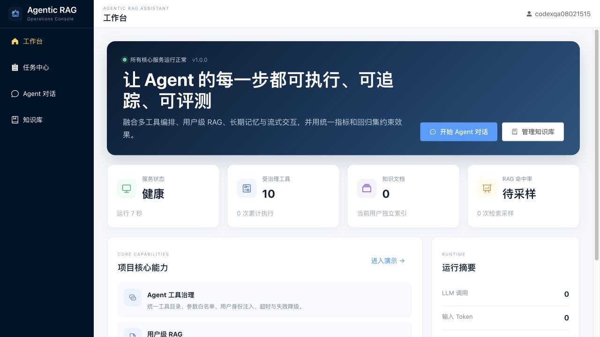
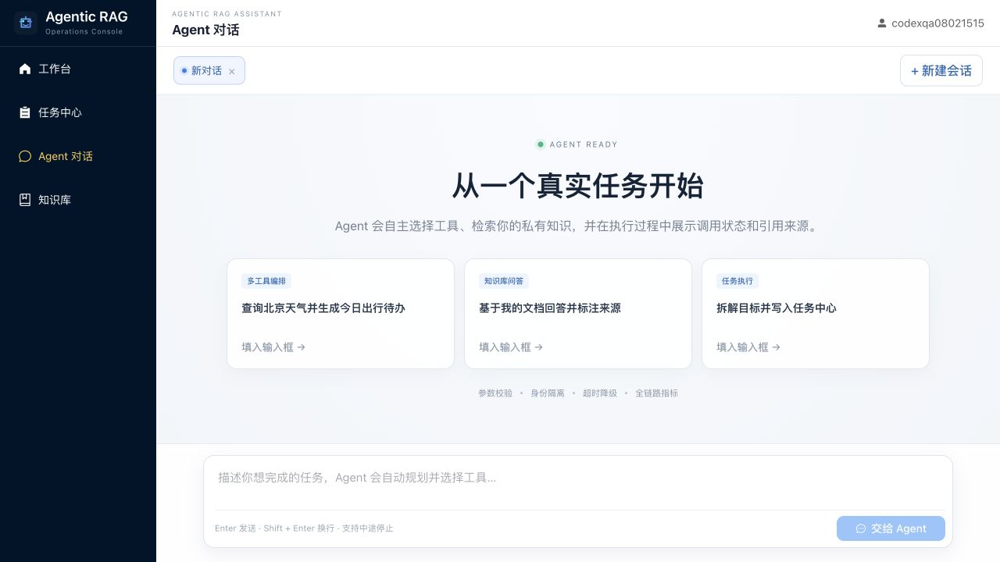
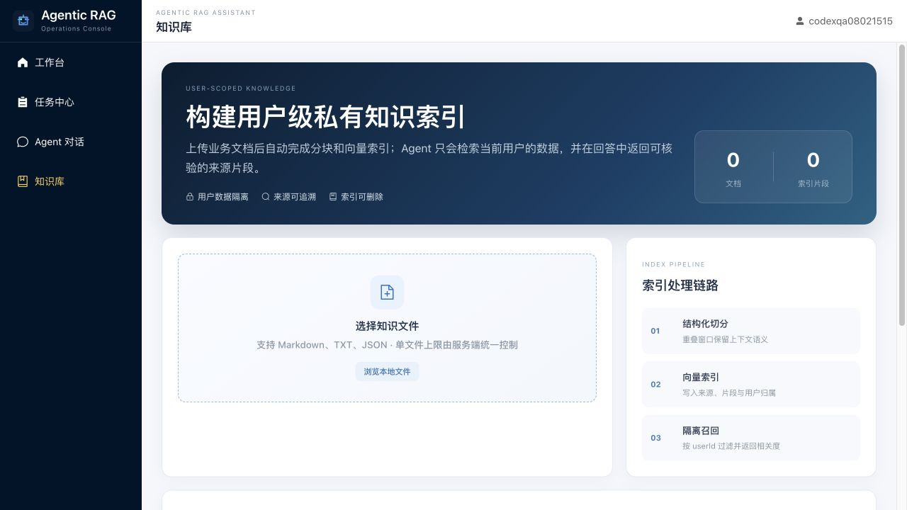
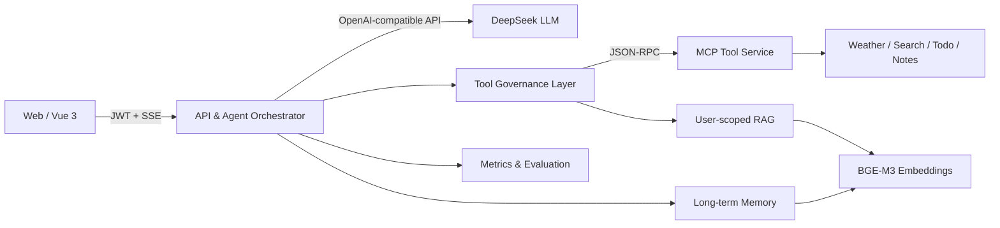

# Agentic RAG Assistant

一个面向真实任务执行的多用户智能体工作台：让大模型在受控边界内调用工具、检索用户私有知识、维护长期记忆，并通过指标与回归评测约束系统质量。

> Vue 3 · Node.js · MCP · Tool Calling · User-scoped RAG · SSE · Prometheus Metrics



| Agent 执行台 | 用户级知识库 |
| --- | --- |
|  |  |

## 项目价值

普通聊天 Demo 只展示“模型能回答”；这个项目重点解决“Agent 如何安全、稳定、可解释地执行任务”。

| 工程问题 | 项目方案 |
| --- | --- |
| 模型可能伪造参数或越权访问 | 工具目录统一声明 schema、scope、transport、timeout；`userId` 只由服务端注入 |
| 多用户知识和记忆容易串数据 | 待办、笔记、RAG、长期记忆均按 JWT 用户身份隔离 |
| 流式网络分片会破坏 JSON/SSE | 增量 SSE 解析器处理任意 chunk 边界、多行 data、重试与主动中断 |
| Agent 效果变化难以发现 | 24 条工具路由回归集，统计 exact accuracy、precision、recall、latency |
| 出错后难以定位 | 请求 ID + HTTP、工具、RAG、LLM 延迟/状态/Token 的 Prometheus 指标 |
| 本地能跑但难以交付 | Node 22 基线、GitHub Actions、三服务 Docker Compose、持久化数据卷 |

## 核心能力

- **受治理的 Agent Loop**：支持天气、实时搜索、时间、待办、笔记、知识检索等 10 个工具，多轮规划并串联执行。
- **用户级 RAG**：上传 Markdown、TXT、JSON，自动分块、向量化、Top-K 召回，答案携带来源片段与相关度。
- **长期记忆**：从对话中提取高置信度用户事实，向量检索相关记忆并注入后续上下文。
- **流式交互**：SSE 增量输出、工具调用状态、停止生成、失败提示、会话恢复和虚拟列表。
- **安全边界**：JWT、bcrypt、文件类型/大小限制、参数白名单、超时控制、用户身份不可由模型传入。
- **可观测与评测**：隐私安全的运行看板、Prometheus 文本指标、离线评测集和 CI 质量门禁。

## 系统架构



一次 Agent 请求的关键路径：

1. API 从 JWT 解析可信 `userId`，仅把公开参数 schema 暴露给模型。
2. LLM 返回 tool calls；治理层校验工具名、参数类型、未知字段和超时策略。
3. 用户级工具由服务端注入身份后执行，模型无法覆盖或伪造 `userId`。
4. 工具结果回填 Agent Loop，直到生成最终答案；过程通过 SSE 推送到前端。
5. HTTP、工具、RAG、LLM 指标被聚合记录，不保存用户问题、文档正文或用户 ID。

更多设计与面试讲解见 [docs/INTERVIEW_GUIDE.md](docs/INTERVIEW_GUIDE.md)。

## 快速开始

### 环境要求

- Node.js `>=22.12 <25`（仓库包含 `.nvmrc`）
- npm
- DeepSeek API Key
- SiliconFlow API Key（BGE-M3 Embedding）
- Serper API Key（可选；未配置时仅网络搜索工具不可用）

### 本地运行

```bash
git clone https://github.com/yiweiyih/agentic-rag-assistant.git
cd agentic-rag-assistant

nvm use
npm ci
npm ci --prefix backend

cp .env.example .env
cp backend/.env.example backend/.env
```

编辑 `backend/.env`，至少填写：

```env
JWT_SECRET=replace-with-at-least-32-random-characters
DEEPSEEK_API_KEY=your-deepseek-key
DEEPSEEK_BASE_URL=https://api.deepseek.com/chat/completions
SILICONFLOW_API_KEY=your-siliconflow-key
SERPER_API_KEY=your-serper-key
```

一条命令启动 Web、API 和 MCP 三个服务：

```bash
npm run dev
```

打开 `http://localhost:5173`，注册一个本地账号即可使用。

| 服务 | 默认地址 |
| --- | --- |
| Web | `http://localhost:5173` |
| API health | `http://localhost:3001/health` |
| API metrics | `http://localhost:3001/metrics` |
| MCP health | `http://localhost:3002/health` |

### Docker Compose

先按上文创建 `backend/.env`，然后运行：

```bash
docker compose up --build
```

- 产品页面：`http://localhost:8080`
- API/指标：`http://localhost:3001`
- 用户、待办、笔记、知识索引和记忆保存在命名卷 `agent-data` 中。

## 质量验证

```bash
# 前端测试 + 生产构建 + 后端语法检查 + 后端测试
npm run check

# 只校验评测集结构与工具 schema，不产生模型费用
npm run eval:tools:dry

# 调用真实模型运行 24 条路由评测并生成 backend/evals/results/latest.json
npm run eval:tools

# 生产依赖安全审计
npm audit --omit=dev --audit-level=high
npm audit --omit=dev --audit-level=high --prefix backend
```

CI 会在 `main`、`feat/agent` push 和 PR 上执行测试、构建、评测集校验、语法检查和高危依赖审计。

## 可观测性

`GET /metrics` 输出 Prometheus 文本格式，覆盖：

- HTTP 请求数与延迟
- 工具调用次数、状态与延迟
- RAG 命中/未命中、结果数与延迟
- LLM 调用状态、延迟、输入/输出 Token

动态路径会归一化，指标中不包含用户 ID、问题内容或文档正文，避免高基数和隐私泄露。

## 主要接口

| Method | Path | 作用 |
| --- | --- | --- |
| `POST` | `/api/register` / `/api/login` | 注册与登录 |
| `POST` | `/api/chat` | Agent Loop + SSE 流式响应 |
| `GET` | `/api/dashboard` | 当前用户文档数和隐私安全运行摘要 |
| `GET/POST` | `/api/todos` | 用户待办查询与新增 |
| `PATCH/DELETE` | `/api/todos/:id` | 完成或删除待办 |
| `GET/POST/DELETE` | `/api/knowledge` | 用户知识文档管理 |
| `GET` | `/health` / `/metrics` | 健康检查与 Prometheus 指标 |

## 目录结构

```text
├── src/                         # Vue 3 产品界面、状态管理、SSE 客户端
├── tests/                       # 前端流式解析测试
├── backend/
│   ├── index.js                 # API、鉴权、Agent Loop、SSE
│   ├── mcp-server.js            # JSON-RPC / MCP 工具服务
│   ├── tools/catalog.js         # 工具 schema、scope、transport、timeout
│   ├── rag/                     # 用户级知识索引与召回
│   ├── memory/                  # 长期记忆抽取与检索
│   ├── observability/           # 低基数运行指标
│   ├── evals/                   # 工具路由数据集与评分器
│   └── test/                    # 后端单元测试
├── .github/workflows/ci.yml     # 自动化质量门禁
├── Dockerfile                   # Web 构建与 Nginx 运行镜像
├── backend/Dockerfile           # API/MCP 共用运行镜像
└── docker-compose.yml           # Web + API + MCP + 持久化卷
```

## 当前边界与演进方向

当前版本适合单机演示和系统设计讨论，持久化使用本地 JSON/向量文件。生产化下一步会将用户和任务迁移到 PostgreSQL，将向量索引迁移到 pgvector/Milvus，并引入 Redis 队列、OpenTelemetry trace、速率限制和更完整的权限模型。

所有密钥只应保存在本地 `backend/.env` 或部署平台 Secret 中，不要提交到 Git。
